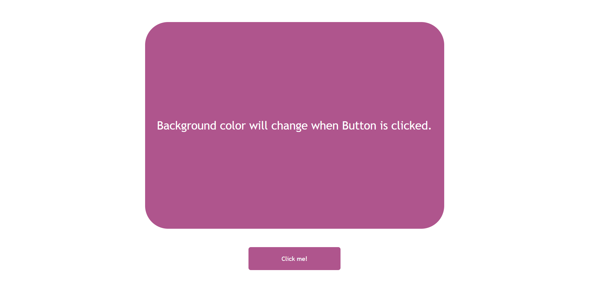

# ColorChanger JavaScript_Project

> ### **Deployed Website** :-[Live Link](https://colorchanger-jsp.netlify.app/)
 

## Project key takeaways:

  - Used Only **JavaScript**, **Html** and **CSS** for this project.
  - Created a random hex color code function for the background color using for loop.
  - Used DOM to target background and assign the random hex color.

   

 
